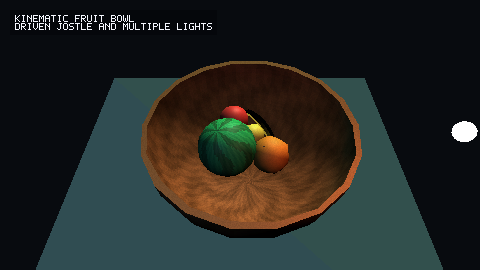
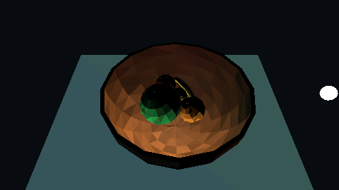
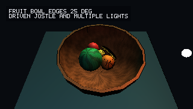
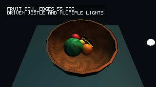
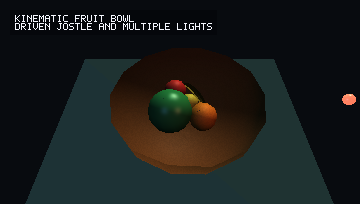
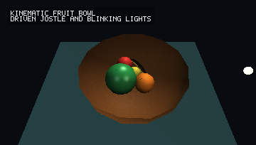
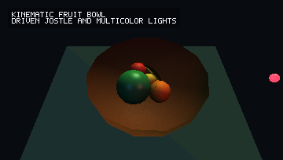
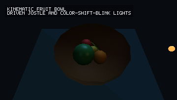

# py_3d

`py_3d` is an early-stage Python package created and maintained by Daniel J. Mueller for fast, basic 3D pixel drawing, rendering, and simulation primitives.

The goal is to become a small, reliable alternative to the simplest parts of
Pygame, with a 3D-first model: draw pixels and primitives, keep depth ordering
simple and predictable, light objects with basic material behavior, and provide
enough collision support to build toy physics, demos, and simulations without
pulling in a full game engine.

This repository now contains the first package foundation: data types for
vectors, colors, buffers, cameras, materials, lights, primitives, scenes, and a
pure-Python CPU reference renderer. The renderer works off-screen, so images can
be produced without a real-time window.


## Render Samples

The images below are generated by the examples in this repository and are kept
in `renderings-tests/` so visual changes are easy to inspect.

| 2D primitives | Lit sphere | Wire box |
| --- | --- | --- |
|  |  |  |

| Texture import | Textured sphere | Ramp and wall |
| --- | --- | --- |
|  |  |  |

| Floor bounce | Wall bank | Bumpy ball |
| --- | --- | --- |
|  |  |  |

| Bumpy ball smooth render |
| --- |
|  |

[View the bumpy ball MP4](renderings-tests/bumpy_ball_physics.mp4)

| Collision override |
| --- |
|  |

| Live py_gpu parity | Fast GPU live preview | Slime fluid |
| --- | --- | --- |
|  |  |  |

[Slime fluid MP4](USER/environments/slime_fluid/renderings/slime_fluid.mp4)

| Rocket tube gas/cloth demo |
| --- |
|  |

[Rocket tube MP4](USER/environments/rocket_tube/renderings/rocket_tube.mp4)

### Fruit Bowl Render Modes

The fruit bowl variants are organized under
`USER/environments/fruit_bowl/renderings/`.
They use the same driven physics scene with different render settings.

| Poly shaded | Smoothed wood | Ray-traced shadows |
| --- | --- | --- |
|  |  |  |

[Poly MP4](USER/environments/fruit_bowl/renderings/fruit_bowl_poly.mp4) |
[Smoothed MP4](USER/environments/fruit_bowl/renderings/fruit_bowl_smooth.mp4) |
[Ray-traced shadows MP4](USER/environments/fruit_bowl/renderings/fruit_bowl_ray_traced.mp4)

| Mirror prelight | Edge threshold 25 deg | Edge threshold 55 deg |
| --- | --- | --- |
|  |  |  |

[Mirror prelight MP4](USER/environments/fruit_bowl/renderings/fruit_bowl_mirror_prelight.mp4)

The poly render preserves the faceted primitive look. The smoothed render keeps
the same collision setup but interpolates vertex normals for fruit and bowl
geometry. The ray-traced shadow render casts direct-light shadow rays at face
scale, which is slower but catches occlusion that simple direct lighting misses.
The edge-highlight stills use angle thresholds to outline boundary and sharp
normal changes, making the bowl lip and hard polygon seams easier to inspect.

| Multiple lights | Blinking lights |
| --- | --- |
|  |  |

| Multicolored lights | Color-shift blinking lights |
| --- | --- |
|  |  |

[Multiple lights MP4](USER/environments/fruit_bowl/renderings/fruit_bowl_multiple_lights.mp4) |
[Blinking lights MP4](USER/environments/fruit_bowl/renderings/fruit_bowl_blinking_lights.mp4) |
[Multicolored lights MP4](USER/environments/fruit_bowl/renderings/fruit_bowl_multicolored_lights.mp4) |
[Color-shift blinking lights MP4](USER/environments/fruit_bowl/renderings/fruit_bowl_color_shift_blink.mp4)

## Project Goals

- Provide a clean Python API for 3D pixel drawing on Windows and Linux.
- Keep the primitive layer simple: points, lines, triangles, boxes, spheres,
  meshes, voxel-like blocks, and blitted pixel buffers.
- Include a basic depth-aware renderer that can draw into an image buffer or
  window surface.
- Support simple light sources:
  - `Lamp`: positional light with distance falloff.
  - `Sun`: directional light with effectively parallel rays.
- Let lights carry RGB color channels and intensity.
- Let objects and materials expose absorption, reflection, and diffuse response
  in a basic, inspectable way.
- Provide a small collision system suitable for examples such as a ball rolling
  down a hill, hitting a wall, or stacking simple objects.
- Stay extensible enough for future simulation work, including fluids.
- Prefer deterministic, explicit behavior over clever hidden state.

## Non-Goals

`py_3d` is a full physics engine. It should be a primitive, teachable, hackable foundation, with lots of room to grow for experienced developers.

The package should also avoid copying Pygame's design wholesale. Pygame is a
useful reference point for simple drawing ergonomics, but this project should
favor a smaller, clearer API that treats depth, light, and simulation as
first-class concepts.

## Current Offline Rendering API

The current renderer can draw lit triangles and simple primitives into an
off-screen buffer:

```python
from py_3d import Camera, Material, RenderEngine, RenderSettings, Scene, Sun, Triangle

scene = Scene()
scene.add(
    Triangle(
        (-1, -1, 0),
        (1, -1, 0),
        (0, 1, 0),
        Material(color=(220, 80, 40)),
    )
)
scene.add_light(Sun(direction=(0, 0, -1), color=(255, 255, 255), intensity=1.0))

camera = Camera(position=(0, 0, -4), target=(0, 0, 0))
settings = RenderSettings(width=320, height=240, background=(8, 10, 14))

buffer = RenderEngine().render(scene, camera, settings)
buffer.to_ppm("triangle.ppm")
```

## Longer-Term API Shape

The exact module names may continue to evolve, but the public API should stay
close to this level of simplicity as windowing and physics are added:

```python
import py_3d as p3d

screen = p3d.Window(width=960, height=540, title="py_3d demo")
scene = p3d.Scene()

red_ball = p3d.Sphere(
    center=(0, 2, 0),
    radius=0.5,
    material=p3d.Material(color=(220, 40, 35), absorption=(0.2, 0.1, 0.1)),
)

hill = p3d.Box(
    center=(0, 0, 0),
    size=(6, 0.25, 3),
    rotation=(0, 0, -18),
    material=p3d.Material(color=(80, 150, 90), absorption=(0.25, 0.35, 0.25)),
)

wall = p3d.Box(
    center=(2.5, 0.7, 0),
    size=(0.25, 1.4, 3),
    material=p3d.Material(color=(180, 180, 190)),
)

scene.add(red_ball, hill, wall)
scene.add_light(p3d.Sun(direction=(-1, -2, -1), color=(255, 245, 230), intensity=0.9))
scene.add_light(p3d.Lamp(position=(1, 3, 2), color=(120, 170, 255), intensity=0.4))

physics = p3d.World(gravity=(0, -9.81, 0))
physics.add_dynamic(red_ball, mass=1.0)
physics.add_static(hill)
physics.add_static(wall)

while screen.open:
    dt = screen.tick(60)
    physics.step(dt)
    screen.draw(scene)
```

## Core Concepts

### 2D Drawing

The first 2D layer is immediate-mode and buffer-based. It supports basic points,
lines, rectangles, and circles through `py_3d.draw`, and it exists both for
simple pixel work and for overlays that may later sit on top of 3D renders.

### Surfaces and Buffers

The lowest layer should be a pixel buffer with predictable memory layout. A
window is only one possible output target. Rendering to an off-screen buffer
should be supported from the beginning so tests, image export, and headless
simulation are easy. Buffers can currently be written as PPM or PNG files.

### Primitives

Primitives are the basic things the package can draw or simulate. They should be
small data objects where possible. Drawing behavior belongs in renderers, and
physics behavior belongs in the collision or world modules.

Useful initial primitives:

- `Point3`
- `Line3`
- `Triangle`
- `Box`
- `Sphere`
- `Capsule`
- `Bowl`
- `LampPrimitive`
- `HangingConeLampPrimitive`
- `Plane`
- `Mesh`
- `FluidBlob`
- `VoxelGrid`

### Materials

Materials define how objects respond to light. Keep this deliberately simple at
first:

- `color`: base RGB color.
- `absorption`: per-channel light absorption.
- `diffuse`: matte response strength.
- `emission`: optional RGB emission for self-lit objects.
- `texture`: optional custom `PixelBuffer` sampled through triangle UV
  coordinates.
- `light_transmission`: fraction of direct light allowed through the material
  during ray-traced shadow checks. `0.0` is opaque; `1.0` fully transmits.
- `roughness`: visual surface dulling/noise response.
- `fuzziness`: visual per-pixel surface variation.
- `specular`: strength of direct light highlights for shiny surfaces.
- `shininess`: highlight tightness. Higher values make smaller, sharper
  highlights.
- `reflectivity`: reflection-like boost for bright highlights. Mirror-style
  materials use low roughness, high specular response, high shininess, and high
  reflectivity. The current CPU renderer produces direct-light mirror
  highlights; recursive scene reflections are a future ray-tracing extension.

Image import currently supports 8-bit, non-interlaced PNG files through
`PixelBuffer.from_png()`. The `assets/tv-test.png` file is used as the first
texture import and rendering test.

Examples can also build procedural textures directly as `PixelBuffer` objects.
The fruit bowl demo uses this for wood grain and watermelon striping, which is
the same path a user would take for imported or generated surface textures.

Visual material attributes are intentionally separate from physics attributes.
For example, `Material.roughness` changes the rendered surface, while
`SphereBody.friction` or `StaticPlane.restitution` changes motion and contact
response.

Generated geometry can also be perturbed. `SurfacePerturbation` uses
deterministic fractal value noise to move generated vertices along their local
surface normal, so a high-poly sphere can become visually bumpy while keeping
its UV mapping. Current physics still treats that object as a sphere unless a
future collision primitive explicitly uses the perturbed mesh.

### Lights

Lights should be data-first and explicit:

- `Lamp(position, color, intensity, radius=None)` for local light emission.
- `Sun(direction, color, intensity)` for directional light.

Lighting should be basic but composable. It is better to have an understandable
Lambert-style model than a large physically based system that is hard to extend.
The CPU reference renderer now includes a simple specular highlight term, so
materials can range from matte to shiny while preserving the same light-source
model.
`RenderSettings(ray_traced_shadows=True)` enables an experimental direct-light
shadow ray test. It is slower and intended for offline inspection, but it helps
catch cases where a face receives light that should be occluded by nearby
geometry. Shadow rays respect `Material.light_transmission`, so an object can
partially pass direct light instead of acting as a fully opaque blocker.
`RenderSettings(shadow_samples=..., shadow_softness=...)` turns lamp shadows
into a deterministic area-light sample when ray-traced shadows are enabled,
which gives higher-spec renders softer, less binary occlusion.

### Rendering

The first renderer should prioritize correctness and clarity:

- Camera projection from 3D world coordinates to 2D pixels.
- Z-buffer or equivalent depth handling.
- Back-face culling where useful.
- Basic shaded triangles and primitive rasterization.
- Optional wireframe and debug-depth modes.
- Optional smoothed vertex lighting for generated primitives while collision
  boundaries remain explicit and unchanged.
- Explicit zero ambient by default, with `RenderSettings(ambient=...)` and
  `RenderSettings(gamma=...)` available when a scene needs fill or display
  correction.

Performance matters, but early optimization should not make the architecture
opaque. When speed work is needed, prefer isolated accelerated paths behind a
stable Python API.

The package already exposes a `Renderer` protocol and `RenderEngine` wrapper.
The built-in `CPURenderer` is the correctness target. Future GPU renderers
should implement the same renderer interface and be validated against the CPU
backend using shared scenes and image/depth expectations.

`RenderSettings(smooth_shading=True)` enables vertex-normal interpolation for
generated primitives such as `Sphere` and `Bowl`. This is a visual-only render
choice: collision still uses the active collider, which may be synced from the
render geometry or overridden independently.

Finite surfaces can be rendered with thickness where supported. `Bowl(...,
thickness=...)` creates an outer shell and sealed rim, while `Plane(...,
size=..., thickness=...)` creates a sealed slab. This keeps presentation
geometry from looking like infinitely thin paper without changing physics
unless a matching collision boundary is selected.

`RenderSettings(edge_highlight=True, edge_highlight_threshold_degrees=35)`
draws an overlay for boundary edges and adjacent faces whose normals differ by
at least the threshold angle. This is useful for presentation outlines and for
debugging where a smoothed render is hiding important polygon boundaries.

`RenderSettings(max_render_distance=...)` culls triangles whose centers are
beyond the requested camera distance. This is an early render-budget control for
live previews and long-range scenes where distant geometry would not affect the
final pixels meaningfully.

Rendering is not limited to real-time windows. Offline rendering is a first
class path: callers can render a `Scene` into a `PixelBuffer`, write it to disk,
inspect pixels in tests, or feed the buffer into a later display backend.

### Mesh And Image Imports

The first import helpers are deliberately small:

- `load_obj(path, material=...)`: loads Wavefront OBJ vertex positions, texture
  coordinates, and faces. Quads and larger polygons are triangulated as fans.
- `load_stl(path, material=...)`: loads ASCII or binary STL triangles.
- `load_mesh_asset(path, material=...)`: loads prepared py_3d mesh assets
  written by `examples/ingest_asset.py`.
- `PixelBuffer.from_png(path)`: imports PNG images for texture tests and future
  surface texturing.
- `planar_project_triangles(...)`: assigns UVs by choosing a local center,
  U/V axes, scale, and offset, then projecting vertices onto that plane.

These helpers are meant to provide practical starting points, not complete
coverage of every feature in each file format.

### Collision and Motion

The collision system should start with simple shapes and simple guarantees:

- Broad phase: cheap bounding checks.
- Narrow phase: sphere, plane, box, and triangle interactions.
- Body types: static, dynamic, and kinematic.
- Forces: gravity, impulses, friction, and restitution.
- `bounciness` aliases restitution for examples and user-facing APIs.
- Deterministic fixed-step simulation support.

The system should be good enough for educational demos and basic simulation
prototypes before it tries to handle advanced rigid-body behavior.

Physics collision boundaries are explicit and may be separate from render
geometry:

- `SphereCollider(radius, offset=...)`
- `CompoundSphereCollider([...])` for simple multi-sphere approximations of
  curved or elongated objects.
- `BoxCollider(size, offset=...)`
- `PlaneCollider(point, normal)`
- `BowlCollider(radius, depth=..., offset=...)`

Dynamic and static bodies derive collision boundaries from their render geometry
by default. For example, a `SphereBody` with no `collision_boundary` uses the
render sphere radius. If the render sphere has `SurfacePerturbation`, the synced
collider includes that perturbation magnitude as a conservative boundary.
Supplying `collision_boundary=...` overrides this. Use
`sync_collision_boundary(force=True)` to intentionally replace an override with
the current render-derived boundary.

The first kinematic body is `KinematicBowl`: callers drive its center over time,
and dynamic `SphereBody` instances respond to the moving bowl surface while
continuing to collide with planes, boxes, and each other. This is useful for
coordinated demos where the environment is animated directly but contained
objects are still simulated.

Dynamic bodies now expose early rigid-body controls:

- `mass`: translational mass used for pairwise impulses.
- `moment_of_inertia`: scalar angular inertia. Spheres default to
  `0.4 * mass * radius ** 2`.
- `angular_velocity` and `rotation`: angular state used by rolling contacts and
  render-driven collision boundaries.
- `static_friction` and `kinetic_friction`: explicit coefficients. The older
  `friction` field remains as a simple default for both.
- `rolling_resistance`: small damping for angular velocity.
- `bounciness`: intuitive alias for restitution. Internally both names resolve
  to the same clamped coefficient.
- `squishiness`: contact softness. Higher values allow more temporary give
  before positional correction.
- `damping` / `dampening`: contact-energy loss. This is coupled with
  `squishiness`, so softer objects rebound less and tend to plop.

Contact friction now applies tangential impulses at the contact point, so a
sphere on a surface can pick up spin instead of only strafing. This is still a
simple educational model, not a full rigid-body solver.
`SphereBody.to_primitive()` also passes body rotation into generated sphere
geometry, so visual texture coordinates and procedural bumps roll with the
physics body by default.

The first fluid scaffold is `FluidWorld` with `FluidBlob` particles. Each blob
has fixed volume, stretch, stretchiness, viscosity, surface tension, wetting,
stickiness, and bounciness. Blobs render through `BlobSurface`, a deformable
volume-preserving mesh that can flatten, stretch, split, and heal visually as
the simple blob physics evolves. This is still an early slime-like bounded
fluid model, not yet a full vertex/particle solver or grid-based fluid.

## Proposed Package Layout

```text
py_3d/
  __init__.py
  buffer.py        # Pixel buffers, color packing, image export helpers
  camera.py        # Camera and projection math
  color.py         # RGB color helpers
  collision.py     # Shape intersection and contact generation
  draw.py          # Immediate-mode primitive drawing helpers
  fluid.py         # Bounded blob fluid primitives
  gpu.py           # Optional GPU renderer scaffold
  importers.py     # OBJ and STL loading helpers
  lights.py        # Lamp, Sun, and lighting utilities
  materials.py     # Material definitions
  math3d.py        # Vectors, matrices, transforms, numeric helpers
  noise.py         # Deterministic procedural noise and surface perturbation
  overlays.py      # Text bulletins and future overlay primitives
  physics.py       # Bodies, world stepping, constraints over time
  primitives.py    # Drawable and collidable primitive data types
  render.py        # Renderers, depth buffers, rasterization
  textures.py      # Texture coordinate helpers
  window.py        # Optional interactive window backend
tests/
examples/
```

This layout is a starting point, not a requirement. Keep modules small and
split them when a file starts mixing unrelated responsibilities.

Current implemented modules are `assets`, `buffer`, `camera`, `collision`,
`color`, `draw`, `gpu`, `importers`, `lights`, `materials`, `math3d`,
`overlays`, `physics`, `noise`, `primitives`, `render`, `scene`, and
`textures`.

## Performance Direction

The package should be fast enough for real-time demos while staying readable.
Recommended path:

1. Build a clear pure-Python reference implementation.
2. Add focused benchmarks for rasterization, depth buffering, collision checks,
   and world stepping.
3. Use standard-library tools first.
4. Add optional acceleration only behind stable interfaces.
5. Keep slow-but-clear reference paths available for tests and debugging.

Potential acceleration options can include NumPy, Numba, Cython, Rust, or C
extensions later, but no acceleration dependency should become mandatory without
a strong reason. GPU backends should slot in as `Renderer` implementations, not
as a parallel scene system. Offline video export should also consume ordinary
`PixelBuffer` frames so CPU and future GPU renderers can share the same output
pipeline.

### GPU Rendering Direction

Accelerated renderer-core work now lives in the sibling `py_gpu` repository.
The intended path is to keep `Scene`, `Camera`, `Material`, `Light`, and
`RenderSettings` stable in this package, then let optional renderers implement
the existing `Renderer` protocol. Good first GPU targets are:

- Upload generated triangles and material data to a backend-managed mesh buffer.
- Keep CPU `PixelBuffer` output available for screenshots, tests, and video.
- Match the CPU renderer on small shared scenes before adding backend-specific
  features.
- Start with a practical backend such as OpenGL, WebGPU, or a native extension
  only after profiling shows the current CPU rasterizer is the bottleneck.

The first in-package GPU entry point is `GPURenderer`. It detects optional
Python GPU packages and, when `py_gpu` is importable, renders through the
accelerated batch bridge. If no accelerated bridge is available it can still
fall back to the CPU renderer; strict mode raises a clear runtime error.
`build_gpu_scene_batch(scene, settings)` remains as a compatibility helper, but
new backend contracts should be added to `py_gpu` first and bridged back through
adapters.

The `py_gpu` bridge has two useful modes:

- Reference-compatible mode delegates to the CPU renderer so outputs match the
  fully shaded material, texture, and overlay path exactly.
- Fast mode projects scene triangles, applies simple per-face lighting, expands
  wireframe edges when requested, and sends the batch to ModernGL or another
  selected backend. This is intended for live navigation and benchmarks while
  fuller GPU material parity is built.

GPU frames can now enter `PixelBuffer` through a lazy packed-RGB view, avoiding
per-pixel `Color` object construction when a caller only needs PPM/PNG/Tk image
bytes. This keeps the old buffer API while making readback-heavy live previews
substantially cheaper.

Live demos that request `--renderer py_gpu` use `py_3d.live.ModernGLLiveRenderer`
when pygame and ModernGL are available. That path presents directly to an
OpenGL window, keeps camera projection and lighting on the GPU, and caches
generated sphere, bowl, and capsule meshes so live frames do not round-trip
through `PixelBuffer`/PPM/Tk. The older Tk `PixelBuffer` viewer remains the CPU
fallback and snapshot/video path.

## Development

This project targets modern Python on Windows and Linux.

Suggested setup once packaging files exist:

```bash
python -m venv .venv
python -m pip install -U pip
python -m pip install -e ".[dev]"
python -m pytest
```

Run the offline example:

```bash
python examples/offline_triangle.py
```

It writes `examples/output/offline_triangle.ppm`.

Generate the current PNG rendering samples:

```bash
python examples/rendering_gallery.py
```

It writes PNG files to `renderings-tests/`.

Generate the texture import sample:

```bash
python examples/texture_demo.py
```

It maps `assets/tv-test.png` onto two textured 3D triangles and writes
`renderings-tests/texture_tv_test.png`.

Generate the textured sphere and polygon sample:

```bash
python examples/textured_sphere_polygons.py
```

It maps `assets/tv-test.png` onto a sphere using generated spherical UVs, maps
the same image onto a polygon panel using planar projection, and includes rough
and fuzzy polygon materials. It writes
`renderings-tests/textured_sphere_polygons.png`.

Generate the bumpy ball physics sample:

```bash
python examples/bumpy_ball_demo.py
```

It renders a TV-textured high-poly sphere with `SurfacePerturbation` noise while
using the current sphere collision model for motion. It writes
`renderings-tests/bumpy_ball_physics.png`.

Render the smoothed visual version or a video:

```bash
python examples/bumpy_ball_demo.py --smooth-shading --output renderings-tests/bumpy_ball_smooth.png
python examples/render_bumpy_ball_video.py --video renderings-tests/bumpy_ball_physics.mp4 --frames 96 --fps 24
```

Generate the collision-boundary override sample:

```bash
python examples/collision_boundary_demo.py
```

It renders bumpy visual geometry with a separate active collision sphere and
shows the difference between synced and overridden collision boundaries. It
writes `renderings-tests/collision_boundary_override.png`.

Generate the kinematic fruit bowl sample:

```bash
python examples/fruit_bowl_demo.py
python examples/fruit_bowl_demo.py --light-mode blinking --output USER/environments/fruit_bowl/renderings/fruit_bowl_blinking_lights.png
python examples/fruit_bowl_demo.py --light-mode multicolor --output USER/environments/fruit_bowl/renderings/fruit_bowl_multicolored_lights.png
python examples/fruit_bowl_demo.py --light-mode color-shift-blink --output USER/environments/fruit_bowl/renderings/fruit_bowl_color_shift_blink.png
```

It drives a `KinematicBowl` with small vertical tosses and angular jostle while several
dynamic fruit bodies bounce inside it and collide with each other. The orange
and lemon use visual
surface perturbation, the watermelon stays smooth, and the banana is a curved
render mesh with a compound collision boundary generated from the same curved
centerline. Fruit bodies use mass, inertia, friction, squishiness, and damping
so collisions read more like soft produce than hard billiard balls. It writes
`USER/environments/fruit_bowl/renderings/fruit_bowl.png`.
The bowl is wood-colored, visually perturbed, and uses higher friction/lower
restitution so it behaves more like a wooden bowl than a hard plastic shell.
The bowl render uses inward smooth normals and disables two-sided lighting so
the inner panels shade more like a concave surface instead of camera-facing
cards.

Render the organized fruit bowl showcase set:

```bash
python examples/render_fruit_bowl_variants.py
```

That writes these named outputs under
`USER/environments/fruit_bowl/renderings/`:

- `fruit_bowl_poly.png` and `fruit_bowl_poly.mp4`
- `fruit_bowl_smooth.png` and `fruit_bowl_smooth.mp4`
- `fruit_bowl_ray_traced.png` and `fruit_bowl_ray_traced.mp4`
- `fruit_bowl_mirror_prelight.png` and `fruit_bowl_mirror_prelight.mp4`
- `fruit_bowl_edges_25deg.png` and `fruit_bowl_edges_55deg.png`

Useful one-off render options:

```bash
python examples/fruit_bowl_demo.py --no-smooth-shading --output USER/environments/fruit_bowl/renderings/fruit_bowl_poly.png
python examples/fruit_bowl_demo.py --smooth-shading --output USER/environments/fruit_bowl/renderings/fruit_bowl_smooth.png
python examples/fruit_bowl_demo.py --ray-traced-shadows --no-smooth-shading --output USER/environments/fruit_bowl/renderings/fruit_bowl_ray_traced.png
python examples/fruit_bowl_demo.py --bowl-material mirror --light-mode mirror-prelight --output USER/environments/fruit_bowl/renderings/fruit_bowl_mirror_prelight.png
python examples/fruit_bowl_demo.py --edge-highlight --edge-highlight-angle 35 --output USER/environments/fruit_bowl/renderings/fruit_bowl_edges_35deg.png
```

The default bowl material uses a procedural wood-grain texture, high matte
roughness, light fuzziness, subtle geometric perturbation, and a small sealed
rim thickness. The mirror bowl uses the same collision behavior but swaps in a
low-roughness, high-reflectivity visual material and a strong prelight lamp
aimed into the bowl before the fruit motion develops. Renderings default to
zero ambient light; add `--ambient` only when intentionally debugging with fill.
Use `--gamma` for display correction without changing the light model.

Run the live fruit bowl viewer:

```bash
python examples/fruit_bowl_live.py
python examples/fruit_bowl_live.py --width 480 --height 270 --window-width 960 --window-height 540
python examples/fruit_bowl_live.py --renderer py_gpu --quality high --light-mode hanging-lamp
python examples/fruit_bowl_live.py --renderer py_gpu --quality fast
python examples/fruit_bowl_live.py --bowl-material mirror --light-mode mirror-prelight
python USER/demos/12_live_fruit_bowl_mirror_prelight.py
python USER/demos/13_live_fruit_bowl_poly_lamp.py
```

The OpenGL viewer captures the mouse; click the window to recapture if needed
and press `Esc` to open the live options menu. Use mouse look, `W/A/S/D` to
move, `Shift`/`Ctrl` to move up/down, `Space` to pause, `R` to toggle between
filled OpenGL rendering and wireframe, `X` to reset, and `P` to save a
snapshot. Aim with the center crosshair and left-click fruit to pick it up;
while holding fruit, mouse look moves it and the scroll wheel changes its
distance from the camera. The GPU live viewer starts filled by default; use
`--live-wireframe` when you specifically want the mesh view first.

Live rendering quality can be changed in `USER/settings.json` with
`render_quality` (`fast`, `balanced`, `high`, `ultra`, or `poly`) and
`render_quality_presets`. The presets control render dimensions, generated mesh
density, smooth/flat normals, gamma, wrap lighting, bounce fill, tone mapping,
texture size, ray-traced shadow sample count/softness, and max render distance.
CLI flags still win for one-off runs.

The `12_live_fruit_bowl_mirror_prelight.py` launcher is the high-spec
performance version of the mirror-prelight scene: 1920x1080, 24x12 generated
meshes, no vsync, and `--fps 0` for an uncapped render loop.

The `13_live_fruit_bowl_poly_lamp.py` launcher is the low-poly wood-bowl demo:
flat live normals, 7x4 generated fruit meshes, a swaying
`HangingConeLampPrimitive` paired with a warm moving `Lamp`, a fixed in-world
sign, and a separate floating bulletin. The primitive showcase descriptors live
in `USER/primitives/`.

Prepare imported OBJ assets for py_3d demos:

```bash
python examples/ingest_asset.py assets/sea-lion-import-test/10041_sealion_v1_L3.obj --name sea_lion --output-dir USER/assets --target-triangles 12000 --source-up z --scale-to-height 1.15 --yaw 90
python USER/demos/14_render_sea_lion_asset.py
```

The ingestion script writes a compact `*.py3dmesh.json` plus a manifest with
source/output counts and transform settings, preserving UVs and geometry unless
a target triangle budget or face-step is requested.

Render a real video file:

```bash
python examples/render_fruit_bowl_video.py --video USER/environments/fruit_bowl/renderings/fruit_bowl.mp4
python examples/render_fruit_bowl_video.py --video USER/environments/fruit_bowl/renderings/fruit_bowl.mov
python examples/render_fruit_bowl_video.py --light-mode color-shift-blink --video USER/environments/fruit_bowl/renderings/fruit_bowl_color_shift_blink.mp4
python examples/render_fruit_bowl_video.py --renderer py_gpu --gpu-fast-render --video USER/environments/fruit_bowl/renderings/fruit_bowl_fast_gpu.mp4
```

Video examples now default to 10 seconds. Override `--frames` and `--fps` when a
short preview is needed.

This requires the FFmpeg command-line executable. `pip install ffmpeg` installs
a Python module named `ffmpeg`; it does not install `ffmpeg.exe`. Install FFmpeg
as a command-line tool, pass `--ffmpeg path/to/ffmpeg`, set `FFMPEG_BINARY`, or
install this package with the optional video extra:

```bash
python -m pip install -e ".[video]"
```

The video script uses a real encoder by default. Add `--allow-frame-fallback`
to write numbered PNG frames when no encoder is available.

Run the live navigation example:

```bash
python examples/live_navigation.py --window-width 960 --window-height 540 --render-width 480 --render-height 270
```

Click into the window to focus controls. Drag or use arrow keys to orbit,
`W/S` to zoom, `A/D` to pan, `Q/E` to move the target up/down, and `P` to save a
snapshot. The window size and render output size are intentionally independent;
use `--no-fit-window` to view the raw render buffer without scaling it to the
window.

For sharper realtime viewing, raise the render target, for example
`--render-width 640 --render-height 360`. Lower it again if navigation becomes
sluggish on a given machine.

The live Tk window uses `assets/py_3d_logo.png` as its window icon.

Live demos prefer `py_gpu` by default. CPU-only runs apply reduced render specs
by default through `--cpu-reduced-specs`: lower render dimensions, lower FPS,
lower generated mesh density, and a shorter render distance. Pass
`--no-cpu-reduced-specs` when intentionally comparing CPU and GPU at the same
settings.

Run the live capsule walking demo:

```bash
python examples/capsule_walk_demo.py --renderer py_gpu --camera-mode third
python examples/capsule_walk_demo.py --renderer py_gpu --camera-mode first
python examples/capsule_walk_demo.py --renderer py_gpu --camera-mode global
```

The OpenGL viewer captures the mouse for first-person look. Use `W/A/S/D` to
move, `Shift`/`Ctrl` to move vertically, `Space` to jump, and `V` to cycle
global, third-person, and first-person cameras. First-person mode hides the
capsule body so the camera is not occluded by its own model. The `py_gpu` path
uses the OpenGL live renderer when available and falls back to the Tk
`PixelBuffer` path if a windowed OpenGL context cannot be created.

Generate the slime-fluid sample:

```bash
python examples/slime_fluid_demo.py --output USER/environments/slime_fluid/renderings/slime_fluid.png
python examples/slime_fluid_demo.py --video USER/environments/slime_fluid/renderings/slime_fluid.mp4
```

It uses bounded `FluidBlob` primitives with fixed volume, stretch-based
splitting, viscosity, surface tension, wetting, stickiness, and healing between
nearby blobs. The render path uses `BlobSurface` so blobs deform as bounded
meshes instead of only drawing perfect spheres.

Generate the rocket tube gas and flag sample:

```bash
python examples/rocket_tube_demo.py --output USER/environments/rocket_tube/renderings/rocket_tube.png
python examples/rocket_tube_demo.py --video USER/environments/rocket_tube/renderings/rocket_tube.mp4
```

This is an early kinetic vector-field/gas demo: the tube has mass, thrust,
drag, and a moving nozzle; exhaust pushes the rocket upward while blue vectors
show the sampled gas stream. The flag is a polygon cloth mesh whose vertices
respond to gas force, cloth weight, and `--wind-tightness`.

Run saved USER environments:

```bash
python USER/tests/run_environment.py --list
python USER/tests/run_environment.py --settings
python USER/tests/run_environment.py -e fruit_bowl --live
python USER/tests/run_environment.py -e fruit_bowl --variant pipeline
python USER/tests/run_environment.py -e slime_fluid --variant video
python USER/tests/run_environment.py -e rocket_tube --variant video
python USER/tests/run_environment.py -e capsule_walk --live third
```

Environment definitions live under
`USER/environments/<name>/environment.json`. Each environment owns its
`renderings/` dir for output media, `baking/` dir for precomputed render data,
and `render-data.json` for commands, output paths, CPU/GPU specs, return codes,
and elapsed time.
The user-level render profile lives at `USER/settings.json`; it records the
standard GPU specs and the reduced CPU fallback specs used by demos and tests.
The environment runner writes a `baking/render-profile.json` manifest each run
so future lightmap, texture-atlas, static-geometry, or baked-render caches have
a stable home.

Turnkey experience scripts live under `USER/demos/`:

```bash
python USER/demos/00_list_experiences.py
python USER/demos/10_live_fruit_bowl_gpu.py
python USER/demos/20_render_feature_previews.py
python USER/demos/30_render_environment_videos.py
python USER/demos/40_run_feature_tests.py
```

Run the physics interaction example:

```bash
python examples/physics_interaction.py
```

It simulates a sphere sliding down a tilted plane into a wall, then writes
`renderings-tests/physics_interaction.png`.

Generate the physics gallery:

```bash
python examples/physics_gallery.py
```

It writes `physics_ramp_wall.png`, `physics_floor_bounce.png`, and
`physics_wall_bank.png` to `renderings-tests/`, plus
`physics_bumpy_ball.png` for a visual-noise rolling ball.

Run the CPU renderer benchmark:

```bash
python examples/render_benchmark.py --frames 60 --width 320 --height 180
python examples/render_benchmark.py --frames 60 --width 320 --height 180 --no-cache
```

The current CPU renderer caches static primitive triangulation, caches triangle
centers and normals, computes camera projection constants once per frame, and
uses direct depth/pixel writes in the triangle hot path. The live viewer also
uses Tk's native integer image scaling when the render size fits the window by
an exact whole-number scale.

Run the GPU entry-point benchmark:

```bash
python examples/gpu_render_benchmark.py --renderer py_gpu --frames 60 --width 320 --height 180
python examples/gpu_render_benchmark.py --renderer py_gpu --reference-compatible --frames 30 --width 320 --height 180
python examples/gpu_render_benchmark.py --renderer scaffold --frames 30 --width 320 --height 180
```

On the current Windows development machine with ModernGL available, the
off-screen `py_gpu` bridge still measures readback-heavy `PixelBuffer` output,
while the OpenGL live renderer avoids that path. A 30-frame direct-window smoke
loop measured the fruit bowl at about `8.3 ms` CPU build plus `0.5 ms` GPU draw
per frame, and the capsule scene at about `1.5 ms` CPU build plus `0.2 ms` GPU
draw per frame. Screenshot and video renderers still use readback by design.

## Testing Expectations

Tests should cover behavior that is easy to accidentally break:

- Projection math and coordinate transforms.
- Depth comparisons and clipping.
- Primitive rasterization edge cases.
- Light color and absorption calculations.
- Collision contact generation.
- Fixed-step simulation determinism.
- Headless rendering to a pixel buffer.

Visual examples are valuable, but they should not replace numeric tests.

## Roadmap

- Define package metadata and initial module layout.
- Implement vector, color, transform, and pixel-buffer primitives.
- Implement immediate-mode 2D and 3D drawing into an off-screen buffer.
- Add camera projection and a basic depth buffer.
- Add `Lamp`, `Sun`, and material absorption.
- Implement basic primitives: line, triangle, box, sphere, bowl, plane.
- Add a minimal window backend for Windows and Linux.
- Add collision detection for spheres, planes, boxes, bowls, and sphere pairs.
- Add a fixed-step physics world with gravity and impulses.
- Expand OBJ/STL import coverage and add more robust texture coordinate paths.
- Expand image import support for texture maps and overlays.
- Build examples:
  - Rotating lit cube.
  - Ball rolling down a hill into a wall.
  - Multiple colored lights.
  - Headless render-to-image test.
  - Textured surface import test.
- Explore voxel and fluid-friendly data structures.

Current generated package/banner artwork lives at
`renderings-tests/github-banner.png`. It is produced by
`examples/rendering_gallery.py` and includes text bulletins plus multiple light
sources.

## TODO

- Expand `FloatingTextBulletin` with more font options, alignment modes, and
  debug callout styling.
- Expand clicked-in mouse and keyboard navigation for real-time and
  wiremesh/wireframe renderings, including reusable camera controllers and basic
  first-person movement modes.
- Add a window backend that can consume the same `RenderEngine` outputs used by
  offline rendering.
- Keep final viewing frame dimensions and output render dimensions independent
  for live viewers, batch renderers, and saved images.
- Add optional accelerated renderers behind the existing `Renderer` protocol.
  Reasonable candidates are NumPy vectorized CPU paths, Numba/Cython native CPU
  paths, and GPU backends through OpenGL, Vulkan, WebGPU, or platform-specific
  compute APIs. The pure-Python CPU renderer should remain the correctness
  reference.
- Add persistent static-asset baking for environments so repeated live and
  offline renders can reuse prepared geometry, material tables, and benchmark
  metadata instead of rebuilding everything each frame.
- Expand render-budget controls: camera-distance culling, occlusion-aware
  skipping, baked lighting for static geometry, and quality presets for live
  preview versus final output.
- Add an optional video helper around rendered `PixelBuffer` frames. Keep
  ffmpeg integration optional and preserve numbered-frame output for machines
  without video tooling.
- Expand importers for OBJ materials, normals, binary edge cases, and STL
  metadata. Keep small fixtures in tests.
- Expand surface texturing beyond affine triangle UVs, including texture
  filtering modes, wrapping modes, and image formats beyond basic PNG.
- Expand procedural surface attributes such as roughness, fuzziness, grain,
  normal-like perturbation, and material presets while keeping them independent
  from physics attributes.
- Add collision modes that can optionally account for perturbed geometry or
  sampled height fields. Keep simple sphere/box/plane collision fast and
  available as the default.
- Expand collision debug rendering so active boundaries can be drawn as
  wireframes or translucent overlays once per-object render modes exist.
- Expand fluids from the current bounded-blob scaffold toward vertex/particle
  surfaces with pressure, surface tension, wetting, stickiness, splitting, and
  edge healing that can respond to obstacles displacing volume.
- Add deformable/breakable solids with material binding strength so objects
  such as a watermelon can combine shell, inner material, stickiness, fracture,
  and fluid-like regeneration after failure.
- Add gas/vector-field emitters that can dissipate, impart forces, and feed
  simple cloth/flag physics for demos such as a rocket tube or nozzle.

## Design Principle

Keep the engine primitive, explicit, and composable. A user should be able to
understand how a pixel got its color, why an object collided, and where to
extend the system without reading thousands of lines of framework code.
