# py3dengine

`py3dengine` is a Python rendering and simulation toolkit for primitive 3D
scenes. It provides a small, inspectable engine for drawing pixels and 3D
primitives, lighting them, applying textures, simulating simple physics, and
running live demo experiences.

The project is intentionally direct: scenes are Python objects, render settings
are explicit, and the CPU renderer remains a readable correctness reference.
Live demos can use the OpenGL-oriented path when available, and the optional
`py_gpu` bridge is prepared as a separate package for GPU backend work.

Install the engine:

```bash
python -m pip install py3dengine
```

Import it:

```python
import py_3d as p3d
```

The PyPI distribution name is `py3dengine`; the Python import package is
`py_3d`.


## Contents

- [What It Includes](#what-it-includes)
- [Install And Setup](#install-and-setup)
- [Quick Start](#quick-start)
- [Visual Showcase](#visual-showcase)
- [Demo Menu](#demo-menu)
- [Rendering Examples](#rendering-examples)
- [Textures And Materials](#textures-and-materials)
- [Physics Examples](#physics-examples)
- [Sky, HUD, And Live Menus](#sky-hud-and-live-menus)
- [GPU Bridge](#gpu-bridge)
- [Project Layout](#project-layout)
- [Development Commands](#development-commands)
- [Release Notes](#release-notes)

## What It Includes

`py3dengine` currently includes:

- A CPU reference renderer for triangles, generated primitives, z-buffering,
  lighting, textures, edge highlighting, text bulletins, and render-to-image
  output.
- A live OpenGL-oriented presentation path for demos that need mouse look,
  window resizing, HUD overlays, menus, and interactive scenes.
- Scene primitives including points, lines, triangles, boxes, spheres, bowls,
  planes, capsules, meshes, lamp primitives, and blob surfaces.
- Materials with diffuse response, absorption, emission, roughness, fuzziness,
  specular highlights, shininess, reflectivity, texture sampling, and
  experimental direct-light ray-traced shadows.
- Simple physics bodies for spheres, boxes, planes, bowls, kinematic objects,
  pairwise impulses, friction, restitution, rolling contacts, angular velocity,
  squishiness, damping, and explicit collision boundaries.
- Early fluid and gas scaffolds, including bounded `FluidBlob` surfaces and
  vector-particle fluid behavior.
- HUD overlay primitives for text, rectangles, images, opacity, and simple
  animations over live scenes.
- A reusable sky prefab with sun angle, day/night time, cycle length, cloud
  toggles, star toggles, and directional sun light derived from the sky state.
- Import helpers for OBJ, STL, prepared `*.py3dmesh.json` assets, PNG textures,
  and planar UV projection.
- User-facing demo scripts under `USER/demos/` for live scenes, still previews,
  videos, and feature tests.

The project is still pre-alpha. The API is usable for experiments and demos, and
the public surface will keep getting tightened as the renderer grows.

## Install And Setup

Install from PyPI:

```bash
python -m pip install py3dengine
```

Install from a local checkout:

```bash
python -m venv .venv
python -m pip install -U pip
python -m pip install -e ".[dev]"
```

Optional video helpers:

```bash
python -m pip install -e ".[video]"
```

Optional GPU bridge after `py_gpu` is published:

```bash
python -m pip install py_gpu
```

or, once both packages are live:

```bash
python -m pip install "py3dengine[gpu]"
```

Video rendering needs an FFmpeg executable. The optional `video` extra can help
locate bundled encoder binaries, but a normal FFmpeg install also works.

## Quick Start

Render a lit triangle into an off-screen buffer:

```python
from py_3d import Camera, Material, RenderEngine, RenderSettings, Scene, Sun, Triangle

scene = Scene()
scene.add(
    Triangle(
        (-1.0, -1.0, 0.0),
        (1.0, -1.0, 0.0),
        (0.0, 1.0, 0.0),
        Material(color=(220, 80, 40)),
    )
)
scene.add_light(Sun(direction=(0.0, 0.0, -1.0), color=(255, 255, 255), intensity=1.0))

camera = Camera(position=(0.0, 0.0, -4.0), target=(0.0, 0.0, 0.0))
settings = RenderSettings(width=320, height=240, background=(8, 10, 14))

buffer = RenderEngine().render(scene, camera, settings)
buffer.to_ppm("triangle.ppm")
```

Run the same idea from the example folder:

```bash
python examples/offline_triangle.py
```

The renderer returns a `PixelBuffer`. A buffer can be inspected in tests, written
as PPM or PNG, resized, used as a texture, or passed to higher-level display
code.

## Visual Showcase

The screenshots below are generated from the repository. Regenerate them with
the commands in [Development Commands](#development-commands).

### Menu And Settings

| Demo launcher | Launcher settings |
| --- | --- |
| 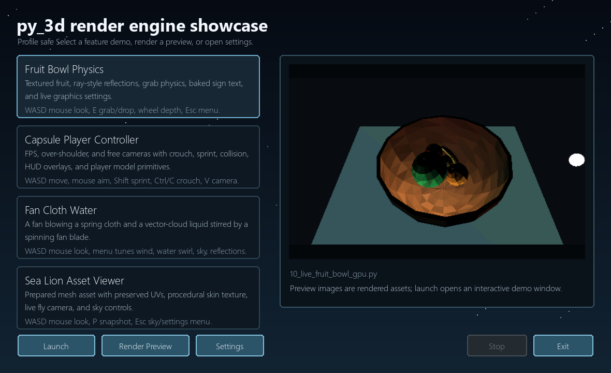 | 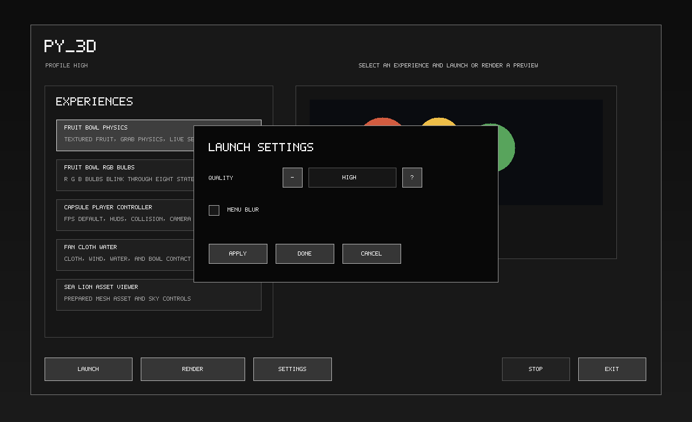 |

| Live settings menu |
| --- |
| 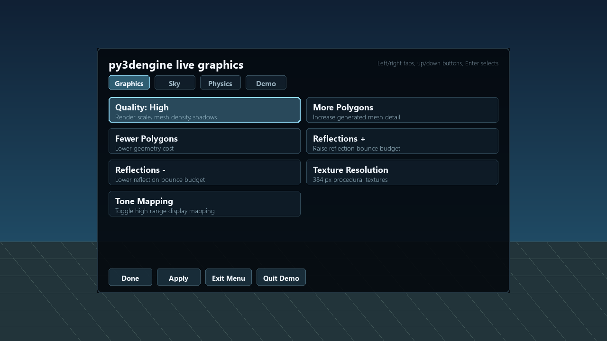 |

The launcher is a game-style menu for choosing experiences, rendering previews,
opening settings, and launching demos. Live demos use a tabbed settings menu
with buttons, mouse interaction, scrollable option groups, and Apply/Done/Exit
controls.

### Rendering Samples

| 2D primitives | Lit triangle | Lit sphere |
| --- | --- | --- |
|  | 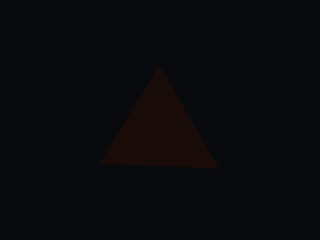 |  |

| Wire box | Texture import | Textured sphere |
| --- | --- | --- |
|  |  |  |

### Physics And Materials

| Ramp and wall | Floor bounce | Wall bank |
| --- | --- | --- |
|  |  |  |

| Bumpy ball | Smooth bumpy ball | Collision override |
| --- | --- | --- |
|  |  | 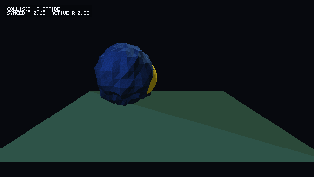 |

### Environment Demos

| Poly fruit bowl | Smooth fruit bowl | Ray-traced shadows |
| --- | --- | --- |
| 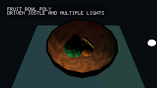 |  | 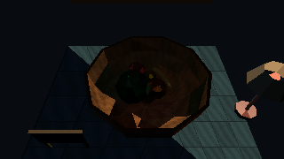 |

| Mirror prelight | Edge highlight | Fan cloth water |
| --- | --- | --- |
| 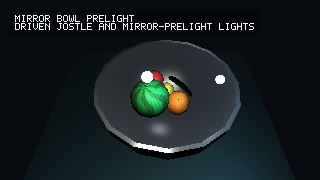 | 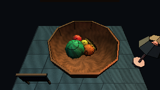 | 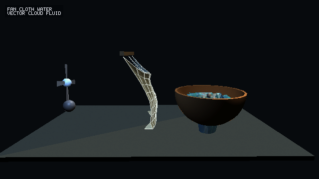 |

| Slime fluid | Rocket tube | Sea lion asset |
| --- | --- | --- |
| 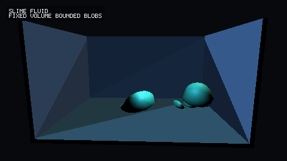 | 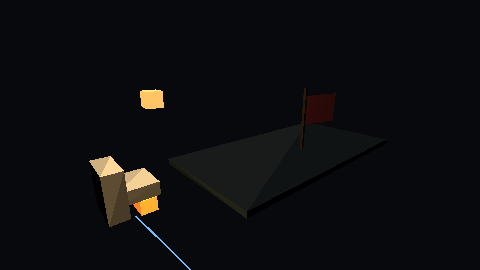 | 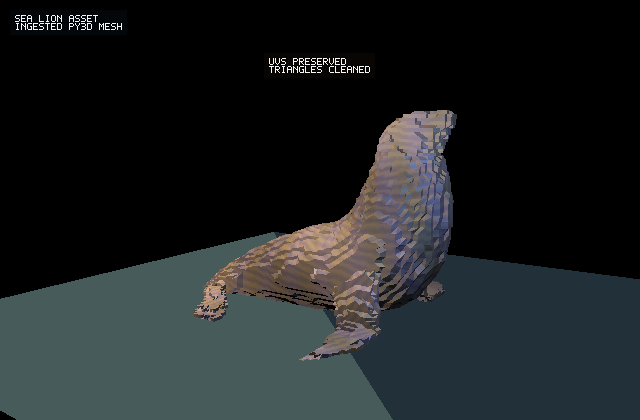 |

## Demo Menu

Open the main demo menu:

```bash
python USER/demos/00_list_experiences.py
```

## Starter JSON CLI

Install the project, then ask the package for its starter commands:

```powershell
python -m pip install -e .
py3dengine --help
```

Use the CLI to pull editable prefab JSON docs or create a starter two-cube
scene with an environment file, object file, and runnable Python file:

```powershell
py3dengine --write-prefab-docs USER/prefab-docs
py3dengine init --output USER/projects/starter-cubes
python USER/projects/starter-cubes/main.py
```

List the experiences without opening a window:

```bash
python USER/demos/00_list_experiences.py --list
```

Launch an experience from the command line:

```bash
python USER/demos/00_list_experiences.py --run 1 --quality safe
```

Dry-run the launch command:

```bash
python USER/demos/00_list_experiences.py --run 1 --dry-run --quality high
```

Render a preview still for a registered experience:

```bash
python USER/demos/00_list_experiences.py --render-preview 3
```

Current menu entries:

| Script | Purpose |
| --- | --- |
| `10_live_fruit_bowl_gpu.py` | Textured fruit, bowl physics, grab/drop, reflections, quality settings, and sky controls. |
| `11_live_capsule_walk.py` | FPS, over-shoulder, and free-camera movement with player model primitives. |
| `12_live_fruit_bowl_mirror_prelight.py` | Higher-spec mirror/prelight version of the fruit bowl scene. |
| `13_live_fruit_bowl_poly_lamp.py` | Low-poly wood bowl, hanging lamp primitive, and baked sign text. |
| `14_render_sea_lion_asset.py` | Prepared mesh asset render with preserved UVs and procedural skin texture. |
| `15_render_fan_cloth_water.py` | Fan, spring cloth, vector-fluid water, and bowl interaction. |
| `20_render_feature_previews.py` | Batch still-image feature previews. |
| `30_render_environment_videos.py` | Batch environment video renders. |
| `40_run_feature_tests.py` | User-facing test runner for demos and environments. |

More detail lives in [docs/live-demos.md](docs/live-demos.md).

## Rendering Examples

### Scene, Camera, Settings

A render uses three main inputs:

- `Scene`: objects, lights, background color, and text bulletins.
- `Camera`: position, target, and field of view.
- `RenderSettings`: image size, background, quality, shading, wireframe,
  shadows, tone mapping, and primitive tessellation.

```python
from py_3d import Box, Camera, Lamp, Material, Plane, RenderEngine, RenderSettings, Scene, Sphere, Sun

scene = Scene()
scene.add(
    Sphere((0, 0.6, 0), 0.6, Material(color=(90, 150, 235), specular=0.35, shininess=30)),
    Box((1.0, 0.3, 0.2), (0.6, 0.6, 0.6), Material(color=(230, 160, 70), roughness=0.5)),
    Plane((0, -0.05, 0), (0, 1, 0), Material(color=(60, 90, 80)), size=5.0),
)
scene.add_light(Sun(direction=(-0.4, -0.8, -1.0), intensity=0.8))
scene.add_light(Lamp(position=(-1.2, 1.6, -1.8), color=(120, 170, 255), intensity=2.2))

camera = Camera(position=(2.0, 1.2, -4.0), target=(0.2, 0.35, 0.0), fov_degrees=48)
settings = RenderSettings(width=640, height=360, smooth_shading=True, ambient=0.04)

RenderEngine().render(scene, camera, settings).to_png("scene.png")
```

### Wireframe And Edge Highlights

Wireframe mode is useful for checking generated geometry:

```python
settings = RenderSettings(width=640, height=360, wireframe=True)
```

Edge highlighting keeps filled geometry but outlines boundaries and sharp normal
changes:

```python
settings = RenderSettings(
    width=640,
    height=360,
    smooth_shading=True,
    edge_highlight=True,
    edge_highlight_threshold_degrees=35,
)
```

### Ray-Traced Direct Shadows

The CPU renderer can trace direct-light shadow rays. This is slower than the
normal lighting path and is best for stills, comparison renders, and high-spec
showcases:

```python
settings = RenderSettings(
    width=480,
    height=270,
    ray_traced_shadows=True,
    shadow_samples=4,
    shadow_softness=0.12,
    reflection_bounces=2,
)
```

`Material.light_transmission` controls how much direct light passes through a
material during shadow checks. `0.0` is opaque; `1.0` is fully transmissive.

More rendering detail lives in [docs/rendering.md](docs/rendering.md).

## Textures And Materials

Materials are deliberately plain Python data:

```python
from py_3d import Material, PixelBuffer

texture = PixelBuffer.from_png("assets/tv-test.png")
material = Material(
    color=(255, 255, 255),
    texture=texture,
    diffuse=0.9,
    roughness=0.35,
    fuzziness=0.05,
    specular=0.25,
    shininess=28.0,
    reflectivity=0.2,
)
```

Generated primitives such as `Sphere`, `Bowl`, and `Capsule` can produce UVs.
For custom triangles or imported meshes, UVs can be supplied directly or created
with planar projection:

```python
from py_3d import planar_project_triangles

triangles = planar_project_triangles(
    triangles,
    center=(0, 0, 0),
    u_axis=(1, 0, 0),
    v_axis=(0, 1, 0),
    scale=1.0,
)
```

## Physics Examples

The physics layer is simple and explicit. A world steps dynamic bodies against
static objects and other dynamic bodies:

```python
from py_3d import PhysicsWorld, SphereBody, StaticPlane

world = PhysicsWorld(gravity=(0, -9.81, 0))
ball = SphereBody(center=(0, 2, 0), radius=0.35, mass=1.0, friction=0.4, bounciness=0.35)
floor = StaticPlane(point=(0, 0, 0), normal=(0, 1, 0), friction=0.8)

world.add_dynamic(ball)
world.add_static(floor)

for _ in range(120):
    world.step(1.0 / 60.0)
```

Render geometry and collision geometry are related but not forced to be the
same. A bumpy visual sphere can keep a simple sphere collider, or a banana-like
mesh can use a compound sphere collider. This keeps demos stable while allowing
visual detail to grow.

Run the physics gallery:

```bash
python examples/physics_gallery.py
python examples/collision_boundary_demo.py
python examples/bumpy_ball_demo.py --smooth-shading --output renderings-tests/bumpy_ball_smooth.png
```

## Sky, HUD, And Live Menus

### Sky Prefab

`SkyPrefab` manages background color, sun direction, clouds, stars, and optional
day/night cycling:

```python
from py_3d import RenderSettings, Scene, SkyPrefab

sky = SkyPrefab(time_of_day=16.0, clouds_enabled=True, stars_enabled=True)
scene = sky.apply(Scene())
settings = sky.settings_for(RenderSettings(width=960, height=540))
```

Manual sun angle is also available:

```python
sky.adjust_sun_angle(elevation_delta=8.0, azimuth_delta=-12.0)
```

### HUD Overlay

Live renderers can draw simple 2D HUD elements over a 3D scene:

```python
from py_3d import HUDRect, HUDText, LiveHUD

hud = LiveHUD()
hud.set(
    HUDRect((14, 14), (230, 72), (4, 8, 13), alpha=0.72),
    HUDText("E grab/drop\nEsc settings", (26, 26), color=(235, 245, 255), scale=2),
)
```

HUD elements are rendered in order. Rectangles can create opaque or translucent
panels, text can be scaled, images can be drawn from `PixelBuffer`, and
`HUDAnimation` can cycle frames.

### Live Menus

`LiveMenu` and `LiveMenuOption` provide the shared settings menu used by the
live demos. Options can be grouped into tabs:

```python
from py_3d.live import LiveMenu, LiveMenuOption

menu = LiveMenu(
    "Graphics Settings",
    (
        LiveMenuOption("quality", "Quality: High", "Render scale and mesh density", "Graphics"),
        LiveMenuOption("reflection_up", "Reflections +", "Raise reflection bounce budget", "Graphics"),
        LiveMenuOption("sky_cycle", "Day/Night Cycle", "Toggle animated sky clock", "Sky"),
        LiveMenuOption("done", "Done"),
        LiveMenuOption("apply", "Apply"),
        LiveMenuOption("cancel", "Exit Menu"),
    ),
)
```

The menu supports mouse hover, mouse click, mouse wheel scrolling, keyboard tab
navigation, Apply/Done/Exit buttons, and footer actions.

## GPU Bridge

`py3dengine` exposes two GPU-related paths:

- `py_3d.live.ModernGLLiveRenderer` for interactive OpenGL presentation in live
  demos.
- `py_gpu`, a separate optional package/repository, which exposes
  `py_gpu.adapters.py3d.Py3DRasterRenderer`.

Local development install:

```bash
python -m pip install -e .
python -m pip install -e ../py_gpu
```

Use the bridge:

```python
from py_3d import RenderEngine
from py_gpu.adapters.py3d import Py3DRasterRenderer

engine = RenderEngine(Py3DRasterRenderer())
```

Benchmark the bridge:

```bash
python examples/gpu_render_benchmark.py --renderer py_gpu
```

The `py_gpu` package owns backend detection, batching contracts, raster
backends, and the `py_3d` adapter.

## Project Layout

```text
src/py_3d/                 engine package
examples/                  runnable examples and render scripts
USER/demos/                game-style user demo launchers
USER/environments/         saved demo environments, renderings, and metadata
USER/primitives/           JSON primitive presets used by demos
renderings-tests/          generated documentation and regression images
tests/                     unit tests
docs/                      focused project documentation
```

Core modules:

| Module | Purpose |
| --- | --- |
| `py_3d.buffer` | `PixelBuffer` and `DepthBuffer`. |
| `py_3d.camera` | Camera projection and view transforms. |
| `py_3d.draw` | Immediate 2D drawing helpers. |
| `py_3d.primitives` | Renderable primitive objects. |
| `py_3d.materials` | Material and texture settings. |
| `py_3d.lights` | `Lamp`, `Sun`, and light samples. |
| `py_3d.render` | CPU renderer, render settings, and renderer protocol. |
| `py_3d.gpu` | GPU detection, scene batching, and optional adapter loading. |
| `py_3d.live` | Live renderer, menu, fly camera, and scene batching. |
| `py_3d.physics` | Physics world, bodies, static colliders, and kinematic bowl. |
| `py_3d.fluid` | Blob and vector-fluid scaffolds. |
| `py_3d.hud` | Live 2D overlay elements. |
| `py_3d.sky` | Sky prefab, sun angle, stars, and clouds. |
| `py_3d.importers` | OBJ and STL loading. |
| `py_3d.assets` | Prepared mesh asset loading. |
| `py_3d.textures` | UV projection helpers. |

## Development Commands

Run tests:

```bash
python -m pytest
```

Build the package:

```bash
python -m build
```

Regenerate documentation images:

```bash
python examples/render_menu_showcase.py
python examples/rendering_gallery.py
python examples/texture_demo.py
python examples/textured_sphere_polygons.py
python examples/physics_gallery.py
python examples/collision_boundary_demo.py
python examples/bumpy_ball_demo.py --output renderings-tests/bumpy_ball_physics.png
python examples/bumpy_ball_demo.py --smooth-shading --output renderings-tests/bumpy_ball_smooth.png
python examples/fruit_bowl_demo.py --no-smooth-shading --width 640 --height 360 --output USER/environments/fruit_bowl/renderings/fruit_bowl_poly.png --label "FRUIT BOWL POLY"
python examples/fruit_bowl_demo.py --smooth-shading --width 640 --height 360 --output USER/environments/fruit_bowl/renderings/fruit_bowl_smooth.png --label "FRUIT BOWL SMOOTH"
python examples/fruit_bowl_demo.py --ray-traced-shadows --reflection-bounces 2 --shadow-samples 4 --shadow-softness 0.12 --no-smooth-shading --width 480 --height 270 --sphere-segments 12 --sphere-rings 6 --output USER/environments/fruit_bowl/renderings/fruit_bowl_ray_traced.png --label "FRUIT BOWL RAY SHADOWS"
python examples/fruit_bowl_demo.py --bowl-material mirror --light-mode mirror-prelight --smooth-shading --width 640 --height 360 --output USER/environments/fruit_bowl/renderings/fruit_bowl_mirror_prelight.png --label "MIRROR BOWL PRELIGHT"
python examples/fruit_bowl_demo.py --edge-highlight --edge-highlight-angle 35 --smooth-shading --width 640 --height 360 --output USER/environments/fruit_bowl/renderings/fruit_bowl_edges_35deg.png --label "FRUIT BOWL EDGES 35 DEG"
python examples/fan_cloth_water_demo.py --quality fast --width 640 --height 360 --output USER/environments/fan_cloth_water/renderings/fan_cloth_water.png
python examples/sea_lion_asset_demo.py --width 640 --height 420 --output USER/environments/sea_lion/renderings/sea_lion_asset.png
python examples/slime_fluid_demo.py --output USER/environments/slime_fluid/renderings/slime_fluid.png
python examples/rocket_tube_demo.py --width 640 --height 360 --output USER/environments/rocket_tube/renderings/rocket_tube.png
```

## Release Notes

The main package is published as `py3dengine` through
`.github/workflows/publish.yml`.

The optional GPU bridge publishes from the separate `py_gpu` repository.

See [docs/publishing.md](docs/publishing.md) for release commands and Trusted
Publisher values.

## Project Direction

`py3dengine` is built around primitive, explicit, composable rendering. A scene
is meant to be easy to inspect, a pixel color should be explainable, and demos
should be playful without hiding the mechanics that make them work.
