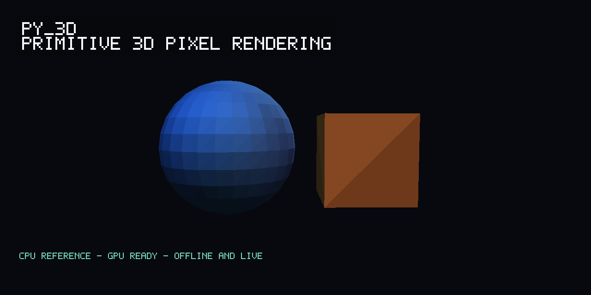
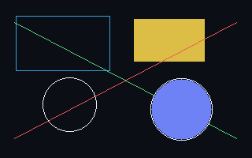
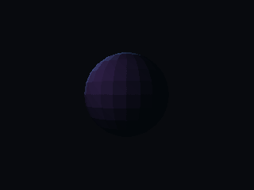
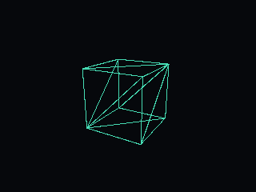
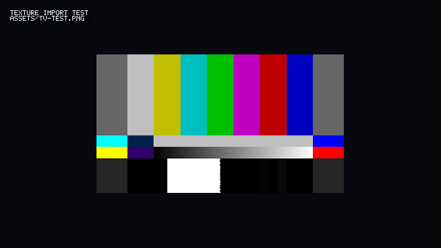
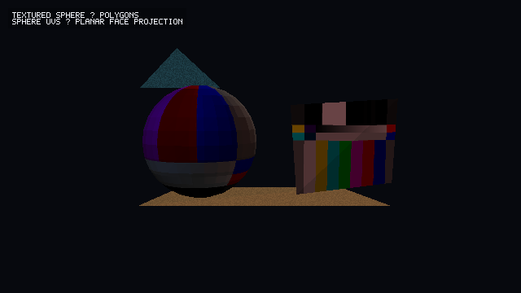
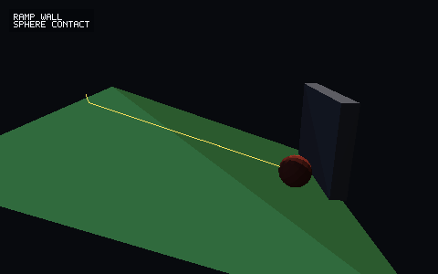
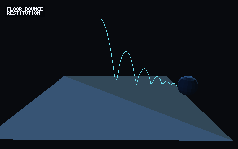
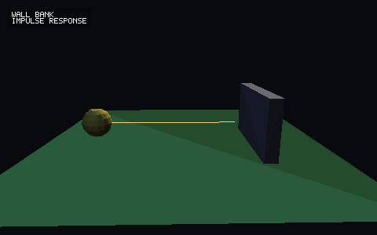
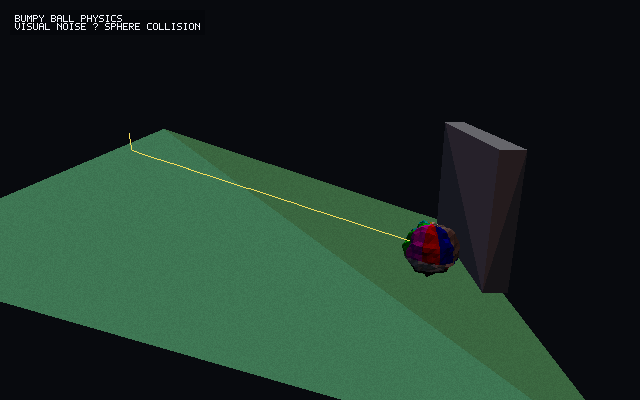

# py_3d

`py_3d` is an early-stage Python package for fast, basic 3D pixel drawing,
rendering, and simulation primitives.

The goal is to become a small, reliable alternative to the simplest parts of
Pygame, with a 3D-first model: draw pixels and primitives, keep depth ordering
simple and predictable, light objects with basic material behavior, and provide
enough collision support to build toy physics, demos, and simulations without
pulling in a full game engine.

This repository now contains the first package foundation: data types for
vectors, colors, buffers, cameras, materials, lights, primitives, scenes, and a
pure-Python CPU reference renderer. The renderer works off-screen, so images can
be produced without a real-time window.



## Render Samples

The images below are generated by the examples in this repository and are kept
in `renderings-tests/` so visual changes are easy to inspect.

| 2D primitives | Lit sphere | Wire box |
| --- | --- | --- |
|  |  |  |

| Texture import | Textured sphere | Ramp and wall |
| --- | --- | --- |
|  |  |  |

| Floor bounce | Wall bank | Bumpy ball |
| --- | --- | --- |
|  |  |  |

## Project Goals

- Provide a clean Python API for 3D pixel drawing on Windows and Linux.
- Keep the primitive layer simple: points, lines, triangles, boxes, spheres,
  meshes, voxel-like blocks, and blitted pixel buffers.
- Include a basic depth-aware renderer that can draw into an image buffer or
  window surface.
- Support simple light sources:
  - `Lamp`: positional light with distance falloff.
  - `Sun`: directional light with effectively parallel rays.
- Let lights carry RGB color channels and intensity.
- Let objects and materials expose absorption, reflection, and diffuse response
  in a basic, inspectable way.
- Provide a small collision system suitable for examples such as a ball rolling
  down a hill, hitting a wall, or stacking simple objects.
- Stay extensible enough for future simulation work, including fluids.
- Prefer deterministic, explicit behavior over clever hidden state.

## Non-Goals

`py_3d` should not try to become Blender, Unity, Unreal, Panda3D, or a complete
physics engine. It should be a primitive, teachable, hackable foundation.

The package should also avoid copying Pygame's design wholesale. Pygame is a
useful reference point for simple drawing ergonomics, but this project should
favor a smaller, clearer API that treats depth, light, and simulation as
first-class concepts.

## Current Offline Rendering API

The current renderer can draw lit triangles and simple primitives into an
off-screen buffer:

```python
from py_3d import Camera, Material, RenderEngine, RenderSettings, Scene, Sun, Triangle

scene = Scene()
scene.add(
    Triangle(
        (-1, -1, 0),
        (1, -1, 0),
        (0, 1, 0),
        Material(color=(220, 80, 40)),
    )
)
scene.add_light(Sun(direction=(0, 0, -1), color=(255, 255, 255), intensity=1.0))

camera = Camera(position=(0, 0, -4), target=(0, 0, 0))
settings = RenderSettings(width=320, height=240, background=(8, 10, 14))

buffer = RenderEngine().render(scene, camera, settings)
buffer.to_ppm("triangle.ppm")
```

## Longer-Term API Shape

The exact module names may continue to evolve, but the public API should stay
close to this level of simplicity as windowing and physics are added:

```python
import py_3d as p3d

screen = p3d.Window(width=960, height=540, title="py_3d demo")
scene = p3d.Scene()

red_ball = p3d.Sphere(
    center=(0, 2, 0),
    radius=0.5,
    material=p3d.Material(color=(220, 40, 35), absorption=(0.2, 0.1, 0.1)),
)

hill = p3d.Box(
    center=(0, 0, 0),
    size=(6, 0.25, 3),
    rotation=(0, 0, -18),
    material=p3d.Material(color=(80, 150, 90), absorption=(0.25, 0.35, 0.25)),
)

wall = p3d.Box(
    center=(2.5, 0.7, 0),
    size=(0.25, 1.4, 3),
    material=p3d.Material(color=(180, 180, 190)),
)

scene.add(red_ball, hill, wall)
scene.add_light(p3d.Sun(direction=(-1, -2, -1), color=(255, 245, 230), intensity=0.9))
scene.add_light(p3d.Lamp(position=(1, 3, 2), color=(120, 170, 255), intensity=0.4))

physics = p3d.World(gravity=(0, -9.81, 0))
physics.add_dynamic(red_ball, mass=1.0)
physics.add_static(hill)
physics.add_static(wall)

while screen.open:
    dt = screen.tick(60)
    physics.step(dt)
    screen.draw(scene)
```

## Core Concepts

### 2D Drawing

The first 2D layer is immediate-mode and buffer-based. It supports basic points,
lines, rectangles, and circles through `py_3d.draw`, and it exists both for
simple pixel work and for overlays that may later sit on top of 3D renders.

### Surfaces and Buffers

The lowest layer should be a pixel buffer with predictable memory layout. A
window is only one possible output target. Rendering to an off-screen buffer
should be supported from the beginning so tests, image export, and headless
simulation are easy. Buffers can currently be written as PPM or PNG files.

### Primitives

Primitives are the basic things the package can draw or simulate. They should be
small data objects where possible. Drawing behavior belongs in renderers, and
physics behavior belongs in the collision or world modules.

Useful initial primitives:

- `Point3`
- `Line3`
- `Triangle`
- `Box`
- `Sphere`
- `Plane`
- `Mesh`
- `VoxelGrid`

### Materials

Materials define how objects respond to light. Keep this deliberately simple at
first:

- `color`: base RGB color.
- `absorption`: per-channel light absorption.
- `diffuse`: matte response strength.
- `emission`: optional RGB emission for self-lit objects.
- `texture`: optional `PixelBuffer` sampled through triangle UV coordinates.
- `roughness`: visual surface dulling/noise response.
- `fuzziness`: visual per-pixel surface variation.

Image import currently supports 8-bit, non-interlaced PNG files through
`PixelBuffer.from_png()`. The `assets/tv-test.png` file is used as the first
texture import and rendering test.

Visual material attributes are intentionally separate from physics attributes.
For example, `Material.roughness` changes the rendered surface, while
`SphereBody.friction` or `StaticPlane.restitution` changes motion and contact
response.

Generated geometry can also be perturbed. `SurfacePerturbation` uses
deterministic fractal value noise to move generated vertices along their local
surface normal, so a high-poly sphere can become visually bumpy while keeping
its UV mapping. Current physics still treats that object as a sphere unless a
future collision primitive explicitly uses the perturbed mesh.

### Lights

Lights should be data-first and explicit:

- `Lamp(position, color, intensity, radius=None)` for local light emission.
- `Sun(direction, color, intensity)` for directional light.

Lighting should be basic but composable. It is better to have an understandable
Lambert-style model than a large physically based system that is hard to extend.

### Rendering

The first renderer should prioritize correctness and clarity:

- Camera projection from 3D world coordinates to 2D pixels.
- Z-buffer or equivalent depth handling.
- Back-face culling where useful.
- Basic shaded triangles and primitive rasterization.
- Optional wireframe and debug-depth modes.

Performance matters, but early optimization should not make the architecture
opaque. When speed work is needed, prefer isolated accelerated paths behind a
stable Python API.

The package already exposes a `Renderer` protocol and `RenderEngine` wrapper.
The built-in `CPURenderer` is the correctness target. Future GPU renderers
should implement the same renderer interface and be validated against the CPU
backend using shared scenes and image/depth expectations.

Rendering is not limited to real-time windows. Offline rendering is a first
class path: callers can render a `Scene` into a `PixelBuffer`, write it to disk,
inspect pixels in tests, or feed the buffer into a later display backend.

### Mesh And Image Imports

The first import helpers are deliberately small:

- `load_obj(path, material=...)`: loads Wavefront OBJ vertex positions, texture
  coordinates, and faces. Quads and larger polygons are triangulated as fans.
- `load_stl(path, material=...)`: loads ASCII or binary STL triangles.
- `PixelBuffer.from_png(path)`: imports PNG images for texture tests and future
  surface texturing.
- `planar_project_triangles(...)`: assigns UVs by choosing a local center,
  U/V axes, scale, and offset, then projecting vertices onto that plane.

These helpers are meant to provide practical starting points, not complete
coverage of every feature in each file format.

### Collision and Motion

The collision system should start with simple shapes and simple guarantees:

- Broad phase: cheap bounding checks.
- Narrow phase: sphere, plane, box, and triangle interactions.
- Body types: static, dynamic, and kinematic.
- Forces: gravity, impulses, friction, and restitution.
- Deterministic fixed-step simulation support.

The system should be good enough for educational demos and basic simulation
prototypes before it tries to handle advanced rigid-body behavior.

## Proposed Package Layout

```text
py_3d/
  __init__.py
  buffer.py        # Pixel buffers, color packing, image export helpers
  camera.py        # Camera and projection math
  color.py         # RGB color helpers
  collision.py     # Shape intersection and contact generation
  draw.py          # Immediate-mode primitive drawing helpers
  importers.py     # OBJ and STL loading helpers
  lights.py        # Lamp, Sun, and lighting utilities
  materials.py     # Material definitions
  math3d.py        # Vectors, matrices, transforms, numeric helpers
  noise.py         # Deterministic procedural noise and surface perturbation
  overlays.py      # Text bulletins and future overlay primitives
  physics.py       # Bodies, world stepping, constraints over time
  primitives.py    # Drawable and collidable primitive data types
  render.py        # Renderers, depth buffers, rasterization
  textures.py      # Texture coordinate helpers
  window.py        # Optional interactive window backend
tests/
examples/
```

This layout is a starting point, not a requirement. Keep modules small and
split them when a file starts mixing unrelated responsibilities.

Current implemented modules are `buffer`, `camera`, `color`, `draw`,
`importers`, `lights`, `materials`, `math3d`, `overlays`, `physics`,
`noise`, `primitives`, `render`, `scene`, and `textures`.

## Performance Direction

The package should be fast enough for real-time demos while staying readable.
Recommended path:

1. Build a clear pure-Python reference implementation.
2. Add focused benchmarks for rasterization, depth buffering, collision checks,
   and world stepping.
3. Use standard-library tools first.
4. Add optional acceleration only behind stable interfaces.
5. Keep slow-but-clear reference paths available for tests and debugging.

Potential acceleration options can include NumPy, Numba, Cython, Rust, or C
extensions later, but no acceleration dependency should become mandatory without
a strong reason.

## Development

This project targets modern Python on Windows and Linux.

Suggested setup once packaging files exist:

```bash
python -m venv .venv
python -m pip install -U pip
python -m pip install -e ".[dev]"
python -m pytest
```

Run the offline example:

```bash
python examples/offline_triangle.py
```

It writes `examples/output/offline_triangle.ppm`.

Generate the current PNG rendering samples:

```bash
python examples/rendering_gallery.py
```

It writes PNG files to `renderings-tests/`.

Generate the texture import sample:

```bash
python examples/texture_demo.py
```

It maps `assets/tv-test.png` onto two textured 3D triangles and writes
`renderings-tests/texture_tv_test.png`.

Generate the textured sphere and polygon sample:

```bash
python examples/textured_sphere_polygons.py
```

It maps `assets/tv-test.png` onto a sphere using generated spherical UVs, maps
the same image onto a polygon panel using planar projection, and includes rough
and fuzzy polygon materials. It writes
`renderings-tests/textured_sphere_polygons.png`.

Generate the bumpy ball physics sample:

```bash
python examples/bumpy_ball_demo.py
```

It renders a TV-textured high-poly sphere with `SurfacePerturbation` noise while
using the current sphere collision model for motion. It writes
`renderings-tests/bumpy_ball_physics.png`.

Run the live navigation example:

```bash
python examples/live_navigation.py --window-width 960 --window-height 540 --render-width 480 --render-height 270
```

Click into the window to focus controls. Drag or use arrow keys to orbit,
`W/S` to zoom, `A/D` to pan, `Q/E` to move the target up/down, and `P` to save a
snapshot. The window size and render output size are intentionally independent;
use `--no-fit-window` to view the raw render buffer without scaling it to the
window.

For sharper realtime viewing, raise the render target, for example
`--render-width 640 --render-height 360`. Lower it again if navigation becomes
sluggish on a given machine.

The live Tk window uses `assets/py_3d_logo.png` as its window icon.

Run the physics interaction example:

```bash
python examples/physics_interaction.py
```

It simulates a sphere sliding down a tilted plane into a wall, then writes
`renderings-tests/physics_interaction.png`.

Generate the physics gallery:

```bash
python examples/physics_gallery.py
```

It writes `physics_ramp_wall.png`, `physics_floor_bounce.png`, and
`physics_wall_bank.png` to `renderings-tests/`, plus
`physics_bumpy_ball.png` for a visual-noise rolling ball.

Run the CPU renderer benchmark:

```bash
python examples/render_benchmark.py --frames 60 --width 320 --height 180
python examples/render_benchmark.py --frames 60 --width 320 --height 180 --no-cache
```

The current CPU renderer caches static primitive triangulation, caches triangle
centers and normals, computes camera projection constants once per frame, and
uses direct depth/pixel writes in the triangle hot path. The live viewer also
uses Tk's native integer image scaling when the render size fits the window by
an exact whole-number scale.

## Testing Expectations

Tests should cover behavior that is easy to accidentally break:

- Projection math and coordinate transforms.
- Depth comparisons and clipping.
- Primitive rasterization edge cases.
- Light color and absorption calculations.
- Collision contact generation.
- Fixed-step simulation determinism.
- Headless rendering to a pixel buffer.

Visual examples are valuable, but they should not replace numeric tests.

## Roadmap

- Define package metadata and initial module layout.
- Implement vector, color, transform, and pixel-buffer primitives.
- Implement immediate-mode 2D and 3D drawing into an off-screen buffer.
- Add camera projection and a basic depth buffer.
- Add `Lamp`, `Sun`, and material absorption.
- Implement basic primitives: line, triangle, box, sphere, plane.
- Add a minimal window backend for Windows and Linux.
- Add collision detection for spheres, planes, and boxes.
- Add a fixed-step physics world with gravity and impulses.
- Expand OBJ/STL import coverage and add more robust texture coordinate paths.
- Expand image import support for texture maps and overlays.
- Build examples:
  - Rotating lit cube.
  - Ball rolling down a hill into a wall.
  - Multiple colored lights.
  - Headless render-to-image test.
  - Textured surface import test.
- Explore voxel and fluid-friendly data structures.

Current generated package/banner artwork lives at
`renderings-tests/github-banner.png`. It is produced by
`examples/rendering_gallery.py` and includes text bulletins plus multiple light
sources.

## TODO

- Expand text bulletins for 3D renderings with more font options, alignment,
  anchoring, debug callouts, and scene-attached labels.
- Expand clicked-in mouse and keyboard navigation for real-time and
  wiremesh/wireframe renderings, including reusable camera controllers and basic
  first-person movement modes.
- Add a window backend that can consume the same `RenderEngine` outputs used by
  offline rendering.
- Keep final viewing frame dimensions and output render dimensions independent
  for live viewers, batch renderers, and saved images.
- Add optional accelerated renderers behind the existing `Renderer` protocol.
  Reasonable candidates are NumPy vectorized CPU paths, Numba/Cython native CPU
  paths, and GPU backends through OpenGL, Vulkan, WebGPU, or platform-specific
  compute APIs. The pure-Python CPU renderer should remain the correctness
  reference.
- Expand importers for OBJ materials, normals, binary edge cases, and STL
  metadata. Keep small fixtures in tests.
- Expand surface texturing beyond affine triangle UVs, including texture
  filtering modes, wrapping modes, and image formats beyond basic PNG.
- Expand procedural surface attributes such as roughness, fuzziness, grain,
  normal-like perturbation, and material presets while keeping them independent
  from physics attributes.
- Add collision modes that can optionally account for perturbed geometry or
  sampled height fields. Keep simple sphere/box/plane collision fast and
  available as the default.

## Design Principle

Keep the engine primitive, explicit, and composable. A user should be able to
understand how a pixel got its color, why an object collided, and where to
extend the system without reading thousands of lines of framework code.
